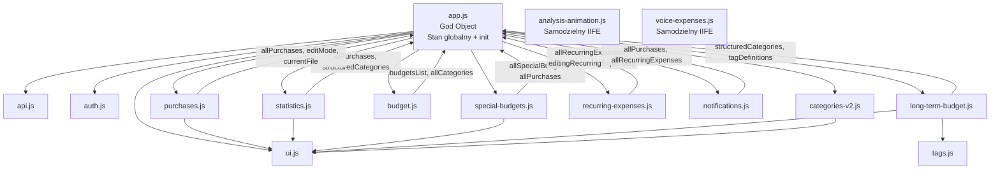

# Plan refaktoryzacji Tracker Wydatków

## 1. Podsumowanie obecnej struktury kodu

### Pliki i ich rozmiary

| Plik | Linie | Rola |
|------|------:|------|
| `long-term-budget.js` | 1 258 | Analiza porównawcza, wykresy słupkowe, gesty swipe na wykresie, filtry kategorii/tagów |
| `ui.js` | 1 132 | Nawigacja (`switchTab`), drawery, modale, formatowanie kwot, helpery DOM |
| `app.js` | 1 045 | **God Object** — konfiguracja Firebase, stan globalny (~30 `let`), logika formularzy zakupów, inicjalizacja eventów, zarządzanie produktami |
| `categories-v2.js` | 938 | Edytor kategorii hierarchicznych, drawer wyboru kategorii, menedżer tagów |
| `statistics.js` | 800 | Dashboard (kokpit), wykresy kołowe i czasowe, picker miesiąca |
| `purchases.js` | 686 | Renderowanie listy zakupów, analiza paragonów AI, obsługa formularza |
| `voice-expenses.js` | 453 | Modal nagrywania głosowego, transkrypcja, analiza AI |
| `notifications.js` | 396 | Powiadomienia: drawer, badge, generowanie alertów budżetowych, AI insights |
| `analysis-animation.js` | 394 | Animacja canvas robota skanującego paragon |
| `special-budgets.js` | 251 | Widok budżetów specjalnych, formularze CRUD |
| `tags.js` | 218 | Helpery tagów, drawer zbiorczego wyboru tagów |
| `recurring-expenses.js` | 208 | Wydatki cykliczne: lista, formularz, CRUD |
| `budget.js` | 124 | Budżet miesięczny: formularz, kopiowanie |
| `auth.js` | 96 | Logika logowania/rejestracji |
| `api.js` | 92 | Wrapper `fetch` z tokenem Firebase |

**HTML**: ~1 600 linii (jeden monolityczny `index.html`)
**CSS**: ~560 linii (`styles.css`) + Tailwind z CDN

---

### Skala chaosu: **średnio-wysoka**

Główne problemy strukturalne:

1. **`app.js` jako God Object** — plik ten zawiera jednocześnie: konfigurację Firebase, ~30 zmiennych globalnych (`allPurchases`, `editMode`, `currentFile` itp.), ~50 referencji do elementów DOM, logikę formularza zakupów, obsługę kamery, i centralną funkcję `initializeApp()`. Prawie każdy inny plik zależy od zmiennych zadeklarowanych tutaj.

2. **Zależności przez zmienne globalne** — pliki nie importują niczego jawnie. Zamiast tego polegają na tym, że `app.js` ładuje się jako ostatni i deklaruje zmienne w zakresie globalnym. Przykłady:
   - `budget.js` czyta `budgetsList`, `allCategories`, `structuredCategories` — wszystkie z `app.js`
   - `special-budgets.js` czyta `allSpecialBudgets`, `allPurchases`, `editingSpecialBudgetId` — z `app.js`
   - `recurring-expenses.js` czyta `allRecurringExpenses`, `editingRecurringExpenseId`, `recurringName` — z `app.js`
   - `notifications.js` czyta `allPurchases`, `allRecurringExpenses`, `structuredCategories` — z `app.js`

3. **`ui.js` miesza odpowiedzialności** — zawiera zarówno ogólne narzędzia DOM (drawery, modele, formatowanie), jak i logikę nawigacji specyficzną dla aplikacji (`switchTab`, `VIEW_DEPTH`). Jest też jedynym miejscem, gdzie zdefiniowano `formatAmount()` — funkcję używaną dosłownie wszędzie.

4. **Duplikacja nazewnictwa i wzorców** — np. `categories-v2.js` i `tags.js` oba otwierają drawery, ale każdy implementuje swój własny mechanizm otwierania/zamykania. Podobnie `voice-expenses.js` ma własny system modali (IIFE), niezależny od `ui.js`.

5. **Kolejność ładowania skryptów jest krytyczna** — w `index.html` skrypty ładują się synchronicznie w określonej kolejności (api → auth → ui → ... → app). Zmiana kolejności natychmiast psuje aplikację.

---

### Mapa zależności (uproszczona)



---

## 2. Rekomendacja w sprawie ES Modules

### Rekomendacja: **TAK, przejdź na ES Modules**

### Uzasadnienie

| Argument | Ocena |
|----------|-------|
| **Jawne zależności** | Obecnie jedynym „interfejsem" między plikami jest globalna przestrzeń nazw `window`. Przy 15 plikach i ~30 współdzielonych zmiennych, śledzenie co od czego zależy wymaga czytania wszystkich plików na raz. ES Modules rozwiązują to strukturalnie. |
| **Kompatybilność z Firebase Hosting** | Firebase Hosting serwuje pliki statycznie — wystarczy dodać `type="module"` do tagów `<script>`. Nie potrzeba Vite, webpacka, ani żadnego bundlera. |
| **Koszt migracji** | Średni. Główna praca to przeniesienie zmiennych globalnych do eksportowanych obiektów/funkcji i dodanie `import/export` na początku plików. Logika biznesowa nie zmienia się ani o linijkę. |
| **Kompatybilność przeglądarek** | ES Modules działają we wszystkich przeglądarkach od 2018 roku. Aplikacja mobilna na Firebase nie obsługuje IE — zero ryzyka. |
| **Prostota** | Natywne `import/export` to najprostsza forma modularyzacji w JS. Nie wymaga konfiguracji, transpilacji, ani plików `package.json` po stronie frontendu. |
| **Ryzyko** | Niskie, pod warunkiem migracji etapowej z testami po każdym etapie. |

### Alternatywa (gdyby decyzja brzmiała „nie")

Bez ES Modules jedynym sposobem na porządek byłoby stworzenie jednego globalnego namespace object (np. `window.App = {}`) i wieszanie na nim wszystkich funkcji i zmiennych. To poprawia czytelność, ale nie eliminuje problemu ukrytych zależności i wymaga dyscypliny, której trudno jest pilnować samemu.

> [!IMPORTANT]
> **Rekomendacja: przejście na ES Modules jest warte wysiłku.** Główny argument: po migracji każdy plik będzie jawnie deklarował, czego potrzebuje od innych modułów. To fundamentalnie zmienia komfort pracy z kodem.

---

## 3. Docelowa lista plików

```
APP/js/
├── main.js                  ← Punkt wejścia: inicjalizacja Firebase, auth observer, bootstrap aplikacji
├── core/
│   ├── config.js            ← Konfiguracja Firebase, stałe aplikacji (API_BASE_URL, IS_DEVELOPMENT)
│   ├── state.js             ← Centralny stan aplikacji (allPurchases, structuredCategories, editMode itp.)
│   ├── api.js               ← Wrapper fetch z tokenem auth (obecny api.js, minimalnie zmieniony)
│   └── auth.js              ← Logika logowania/rejestracji (obecny auth.js + fragment z app.js)
├── shared/
│   ├── ui.js                ← Nawigacja (switchTab), drawery ogólne, modele, overlay management
│   ├── format.js            ← formatAmount(), formatDate(), i inne helpery formatowania
│   ├── categories.js        ← Drawer wyboru kategorii hierarchicznych, helpery kategorii (getParentCategoryByName itp.)
│   └── tags.js              ← Helpery tagów, drawer zbiorczego wyboru tagów (obecny tags.js)
├── views/
│   ├── dashboard.js         ← Kokpit: renderDashboard(), wykresy kołowe, picker miesiąca, przegląd kategorii
│   ├── purchase-form.js     ← Formularz dodawania/edycji zakupu, analiza paragonów AI, kamera, modal głosowy, animacja
│   ├── purchase-list.js     ← Lista zakupów z filtrami, paginacja, wyszukiwanie, usuwanie
│   ├── analysis.js          ← Analiza długoterminowa: wykresy porównawcze, gesty, shop chart, filtry
│   ├── special-budgets.js   ← Widok budżetów specjalnych + wykresy doughnut
│   └── settings.js          ← Ustawienia: edytor kategorii, budżet miesięczny, wydatki cykliczne, budżety specjalne (CRUD)
```

### Opis ról (po jednym zdaniu)

| Plik | Rola |
|------|------|
| `main.js` | Jedyny plik z `<script>` w HTML — importuje moduły, inicjalizuje Firebase, ustawia `onAuthStateChanged`, wywołuje bootstrap. |
| `core/config.js` | Eksportuje konfigurację Firebase i stałe środowiskowe. |
| `core/state.js` | Eksportuje obiekt `AppState` z getterami/setterami dla wspólnych danych (zakupy, kategorie, tagi, budżety, tryb edycji). |
| `core/api.js` | Eksportuje `apiCall()` — jedyna zmiana to import `auth` z `config.js` zamiast globala. |
| `core/auth.js` | Eksportuje funkcje logowania/rejestracji/wylogowania oraz referencje `auth` i `db`. |
| `shared/ui.js` | Eksportuje `switchTab()`, `openSelectionDrawer()`, `closeSelectionDrawer()`, `openOverlay()`, `closeOverlay()`, zarządzanie historią nawigacji. |
| `shared/format.js` | Eksportuje `formatAmount()`, `formatDate()` i inne funkcje formatujące używane w wielu widokach. |
| `shared/categories.js` | Eksportuje `openHierarchicalCategoryDrawer()`, `applyCategorySelectionState()`, `getParentCategoryByName()` — logikę wyboru kategorii współdzieloną między formularzem zakupów, wydatkami cyklicznymi i analizą. |
| `shared/tags.js` | Eksportuje helpery tagów i drawer zbiorczego wyboru — obecny `tags.js`, uzupełniony o jawne importy. |
| `views/dashboard.js` | Eksportuje `renderDashboard()` i `initDashboard()` — cały obecny kokpit z `statistics.js`. |
| `views/purchase-form.js` | Eksportuje `initPurchaseForm()`, `fillFormWithAnalysis()` — logika formularza z `app.js`, analiza paragonów AI, `voice-expenses.js`, `analysis-animation.js`, obsługa kamery i plików. |
| `views/purchase-list.js` | Eksportuje `renderPurchasesList()`, `initPurchaseListFilters()` — rendering listy zakupów, filtry daty, wyszukiwanie, paginacja, obsługa usuwania zakupów. |
| `views/analysis.js` | Eksportuje `initializeLongTermBudget()` — obecny `long-term-budget.js` z jawnymi importami. |
| `views/special-budgets.js` | Eksportuje `renderSpecialBudgetsTab()` — obecny `special-budgets.js` z jawnym importem stanu. |
| `views/settings.js` | Eksportuje `initSettings()` — scala logikę edytora kategorii (`categories-v2.js`), budżetu (`budget.js`), wydatków cyklicznych (`recurring-expenses.js`), i zarządzania budżetami specjalnymi. |

> [!NOTE]
> Plik `notifications.js` zostaje włączony do `main.js` (inicjalizacja) + `views/dashboard.js` (generowanie powiadomień budżetowych) — nie potrzebuje osobnego modułu, bo jego logika naturalne dzieli się na te dwa konteksty.

---

## 4. Plan etapów prac

### Etap 1: Fundament modularny — `type="module"` + core/

**Cel:** Włączyć ES Modules i wyekstrahować fundament (konfiguracja, API, auth, stan).

**Zakres prac:**
1. Zmienić wszystkie `<script>` w `index.html` na jeden `<script type="module" src="js/main.js">` 
2. Stworzyć `core/config.js` — przenieść `firebaseConfig`, `IS_DEVELOPMENT`, `API_BASE_URL`, inicjalizację `firebase.initializeApp()`
3. Stworzyć `core/api.js` — przenieść obecny `api.js`, zamienić globalne `auth` na import z `config.js`
4. Stworzyć `core/auth.js` — przenieść obecny `auth.js` + fragmenty auth-related z `app.js`
5. Stworzyć `core/state.js` — zebrać wszystkie globalne `let` z `app.js` (ok. 30 zmiennych) i referencje DOM do jednego eksportowanego obiektu
6. Stworzyć `main.js` — import core modules, `onAuthStateChanged`, wywołanie `fetchInitialData()` i `initializeApp()`

> [!IMPORTANT]
> **Po tym etapie aplikacja będzie miała dwa współistniejące systemy**: stare pliki (jeszcze globalowe) i nowe moduły core. Na tym etapie to jest w porządku — stare pliki zostaną zmigrowane w kolejnych etapach. Kluczowe jest, żeby `main.js` poprawnie zainicjalizował Firebase i auth, a stare pliki mogły nadal czytać stan z `window` (tymczasowo wyeksponowany z `state.js`).

**🧪 Punkt testów manualnych:**
- [x] Logowanie i rejestracja działają
- [x] Po zalogowaniu ładują się dane (zakupy, kategorie, budżety)
- [x] Dashboard wyświetla poprawne podsumowanie miesiąca

> [!NOTE]
> **Status Etapu 1:** Zakończono pozytywnie. Fundamenty modularne (`core/config.js`, `core/api.js`, `core/auth.js`, `core/state.js`) działają poprawnie, a `main.js` prawidłowo zarządza inicjalizacją i pomostem (bridge) do starego kodu.

---

### Etap 2: Warstwa współdzielona — `shared/`

**Cel:** Wydzielić funkcje używane przez wiele widoków do osobnych modułów.

**Zakres prac:**
1. Stworzyć `shared/format.js` — wyciągnąć `formatAmount()` i inne helpery formatowania z `ui.js`
2. Stworzyć `shared/ui.js` — przenieść z `ui.js`: `switchTab()`, `VIEW_DEPTH`, mechanizm drawerów (`openSelectionDrawer`, `closeSelectionDrawer`), overlaye, zarządzanie historią nawigacji (`popstate`)
3. Stworzyć `shared/categories.js` — przenieść z `categories-v2.js`: `openHierarchicalCategoryDrawer()`, `applyCategorySelectionState()`, `getParentCategoryByName()`, `getSubCategoryByName()` i inne helpery wspólne dla formularza zakupów i analizy
4. Stworzyć `shared/tags.js` — obecny `tags.js` + jawne importy stanu

**Po tym etapie** stary `ui.js` i `categories-v2.js` powinny być puste lub zawierać już tylko logikę specyficzną dla widoku Settings (edytor kategorii, menedżer tagów).

**🧪 Punkt testów manualnych:**
- [x] Nawigacja między zakładkami (dolny pasek)
- [x] Historia przeglądarki (przycisk wstecz) działa poprawnie
- [x] Drawer wyboru kategorii otwiera się z formularza zakupów
- [x] Drawer wyboru tagów otwiera się i zamyka poprawnie
- [x] Formatowanie kwot (np. "1 234,56 zł") wyświetla się poprawnie

> [!NOTE]
> **Status Etapu 2:** Zakończono pozytywnie. Wyczyszczono stare pliki `tags.js`, `api.js`, `auth.js` oraz zmigrowano współdzieloną logikę z `ui.js` i `categories-v2.js` do folderu `shared/`. Aplikacja zachowuje pełną stabilność.

---

### Etap 3: Widoki — `views/dashboard.js` + `views/purchase-form.js` + `views/purchase-list.js`

**Cel:** Zmigrować dwa największe i najważniejsze widoki do modułów.

**Zakres prac:**
1. Stworzyć `views/dashboard.js` — przenieść z `statistics.js`: `renderDashboard()`, wykresy kołowe (doughnut), wykres czasowy, picker miesiąca kokpitu, logikę modal szczegółów kategorii. Połączyć z logiką powiadomień budżetowych z `notifications.js`
2. Stworzyć `views/purchase-form.js` — przenieść:
   - z `app.js`: logika formularza zakupów (dodawanie/edycja), zarządzanie produktami w koszyku (`currentPurchaseItems`), obsługa kamery, obsługa plików
   - z `purchases.js`: analiza paragonów AI, `fillFormWithAnalysis()`
   - wchłonąć `voice-expenses.js` (modal głosowy) i `analysis-animation.js` (animacja skanowania)
3. Stworzyć `views/purchase-list.js` — przenieść:
   - z `purchases.js`: rendering listy zakupów, filtry daty, wyszukiwanie
   - z `app.js`: obsługa paginacji, usuwanie zakupów, wejście w tryb edycji

**🧪 Punkt testów manualnych:**
- [x] Dashboard: picker miesiąca, kafelki kategorii, ostatnie transakcje
- [x] Dashboard: kliknięcie w kategorię otwiera drawer szczegółów
- [x] Dodawanie zakupu ręcznie (formularz + zapis)
- [x] Edycja istniejącego zakupu
- [x] Usuwanie zakupu
- [x] Analiza zdjęcia paragonu (tryb AI)
- [x] Nagranie głosowe → transkrypcja → analiza AI
- [x] Dodawanie/usuwanie produktów w formularzu
- [x] Lista zakupów: paginacja, filtry daty, wyszukiwanie

> [!NOTE]
> **Status Etapu 3:** Zakończono pozytywnie. Utworzono `views/dashboard.js`, `views/purchase-form.js` i `views/purchase-list.js`, przepięto `main.js` na nowe moduły, usunięto ładowanie przeniesionych legacy skryptów z `index.html` oraz zastąpiono stare pliki migracyjnymi placeholderami. Po szybkich testach manualnych nie stwierdzono regresji.

---

### Etap 4: Widoki — `views/analysis.js` + `views/special-budgets.js` + `views/settings.js`

**Cel:** Zmigrować pozostałe widoki i usunąć stare pliki.

**Zakres prac:**
1. Stworzyć `views/analysis.js` — przenieść cały `long-term-budget.js` jako moduł z jawnymi importami (state, api, categories, tags, format, ui)
2. Stworzyć `views/special-budgets.js` — przenieść z `special-budgets.js`: widok kart budżetów + wykresy doughnut
3. Stworzyć `views/settings.js` — scala:
   - z `categories-v2.js`: edytor kategorii nadrzędnych i podkategorii, formularz ikon/kolorów, menedżer tagów
   - z `budget.js`: formularz budżetu miesięcznego, kopiowanie budżetu
   - z `recurring-expenses.js`: lista wydatków cyklicznych, formularz dodawania/edycji
   - z `special-budgets.js`: formularz CRUD budżetów specjalnych (część ustawień)
4. Zaktualizować `main.js` — usunąć wszelkie tymczasowe `window.*` eksporty, upewnić się że wszystkie widoki są importowane i inicjalizowane

**Po tym etapie** wszystkie stare pliki (`ui.js`, `app.js`, `statistics.js`, `purchases.js`, `categories-v2.js`, `tags.js`, `budget.js`, `special-budgets.js`, `recurring-expenses.js`, `long-term-budget.js`, `notifications.js`, `voice-expenses.js`, `analysis-animation.js`, `auth.js`, `api.js`) powinny zostać usunięte.

**🧪 Punkt testów manualnych:**
- [ ] Analiza długoterminowa: przełączanie zakładek (tydzień/miesiąc/6m/rok)
- [ ] Analiza: filtry kategorii (chipy), filtry tagów
- [ ] Analiza: swipe na wykresie zmienia zakres
- [ ] Analiza: long-press na słupku otwiera szczegóły
- [ ] Wykres sklepów
- [ ] Budżety specjalne: widok kart z wykresami doughnut
- [ ] Ustawienia → Kategorie: dodawanie/edycja/usuwanie kategorii i podkategorii
- [ ] Ustawienia → Tagi: dodawanie/edycja/usuwanie grup tagów i tagów
- [ ] Ustawienia → Budżet: ustawianie i kopiowanie budżetu
- [ ] Ustawienia → Subskrypcje: dodawanie/edycja/usuwanie wydatków cyklicznych
- [ ] Ustawienia → Budżety specjalne: CRUD

---

### Etap 5: Czyszczenie i konsolidacja

**Cel:** Usunąć resztki starego kodu, oczyścić `index.html`, zamienić inline onclick na event listenery.

**Zakres prac:**
1. Usunąć wszystkie stare pliki `js/*.js` (zastąpione przez nową strukturę)
2. W `index.html` — usunąć stare `<script>` tagi, zostawić tylko `<script type="module" src="js/main.js">`
3. Zweryfikować, że nie ma żadnych `window.*` eksportów ani odwołań do zmiennych globalnych
4. **Zamienić wszystkie inline `onclick="..."` w HTML na event listenery w JS** — przeszukać `index.html` pod kątem `onclick="switchTab(...)"`, `onclick="deleteNotification(...)"` i podobnych, usunąć je z HTML i dodać odpowiednie `addEventListener()` w odpowiednich modułach (np. `shared/ui.js` dla nawigacji, `views/dashboard.js` dla powiadomień)
5. Zaktualizować `?v=` cache busting lub usunąć go (moduły mają inne reguły cachowania)

**🧪 Punkt testów manualnych (pełna regresja):**
- [ ] Logowanie, wylogowanie, rejestracja
- [ ] Dashboard z danymi i bez danych
- [ ] Dodawanie zakupu w każdym trybie (ręczny, zdjęcie, głos, plik)
- [ ] Lista zakupów z filtrami
- [ ] Edycja i usuwanie zakupu
- [ ] Analiza ze wszystkimi zakresami czasowymi
- [ ] Budżety specjalne
- [ ] Wszystkie widoki ustawień
- [ ] Powiadomienia: drawer, odczytywanie, usuwanie
- [ ] Nawigacja historią przeglądarki
- [ ] Deploy na Firebase Hosting i test na telefonie

---

## 5. Zauważone problemy techniczne (osobna lista)

> [!NOTE]
> Poniższe problemy **NIE** są częścią planu refaktoryzacji. Odnotuję je, bo mogą być przydatne w przyszłości.

| # | Problem | Opis |
|---|---------|------|
| 1 | **Inline `onclick` w HTML** | Kilkanaście elementów używa `onclick="switchTab('...')"` lub `onclick="deleteNotification('...')"`. Zostaną zamienione na event listenery w Etapie 5. |
| 2 | **Brak error boundary** | Jeśli `fetchInitialData()` lub `renderDashboard()` rzuci wyjątek, cała aplikacja się „wiesza" bez komunikatu. |
| 3 | **Duplikacja drawerów** | `voice-expenses.js` implementuje własny system modal (IIFE z wewnętrznym state machine), niezależny od `openOverlay/closeOverlay` z `ui.js`. Po refaktoryzacji warto ujednolicić. |
| 4 | **Hardcoded cache-busting** | Wszystkie `<script src="js/file.js?v=12">` mają ręcznie bumpowany numer wersji. ES Modules + nowe nazwy plików rozwiążą to naturalnie, ale warto rozważyć hash-based busting w przyszłości. |
| 5 | **`console.log` w production** | `analysis-animation.js` zawiera `console.log('[V12] Drawing frame')` wywoływany co 60 klatek — debug artefakt. |
| 6 | **Pamięć wykresów Chart.js** | `special-budgets.js` prawidłowo czyści stare instancje wykresów, ale `statistics.js` nie zawsze wywołuje `destroy()` przed ponownym renderem. |
| 7 | **Kolejność ładowania Flatpickr** | Flatpickr ładuje się po `app.js`, co oznacza, że `flatpickr()` musi być wywoływany dopiero po `DOMContentLoaded`. Przy ESM to rozwiąże się naturalnie (moduły są defer). |

---

## Decyzje podjęte

- ✅ **Purchases** — rozbite na `views/purchase-form.js` (formularz, AI, głos) + `views/purchase-list.js` (lista z filtrami)
- ✅ **Inline onclick** — zostaną zamienione na event listenery w JS (Etap 5)
