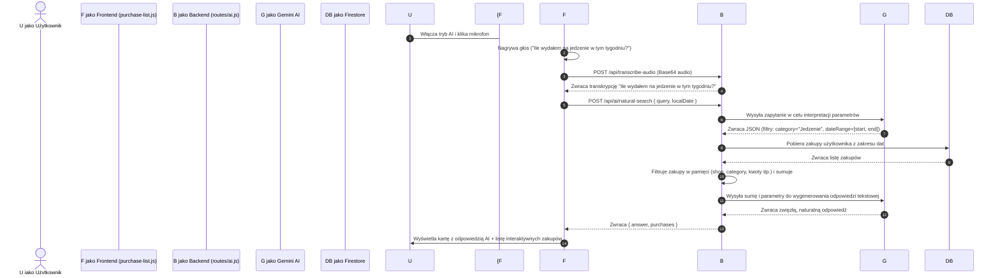

# Plan Wdrożenia: Wyszukiwanie Naturalne i Głosowe za pomocą AI

Wyszukiwanie naturalne pozwoli użytkownikom na zadawanie pytań w języku naturalnym (np. *"Ile wydałem w Biedronce w zeszłym miesiącu?"*). 

Dzięki integracji **wyszukiwania głosowego**, użytkownik będzie mógł również kliknąć ikonę mikrofonu i podyktować swoje pytanie bezpośrednio do telefonu lub komputera, bez konieczności pisania.

Do realizacji tego zadania wykorzystamy podejście **Text-to-Query (Function Calling)** oraz istniejący endpoint transkrypcji audio:
1. **Frontend** nagra dźwięk, prześle do `/api/transcribe-audio` (reużycie backendu), a transkrypcję wstawi do paska wyszukiwania.
2. **AI (Gemini)** zinterpretuje tekst intencji (zakres dat, kategorię, sklep, słowa kluczowe).
3. **Backend** pobierze dane z bazy Firestore i precyzyjnie przefiltruje je w pamięci (zapobiega to problemom z indeksami Firestore).
4. **AI** otrzyma zsumowane statystyki i wygeneruje naturalną odpowiedź konwersacyjną.
5. **Frontend** wyświetli szklaną kartę odpowiedzi AI u góry listy, a pod nią wylistuje dokładnie te transakcje.

---

## Proponowane Zmiany



---

## Szczegółowy Zakres Prac

### 1. Backend (Cloud Functions)

#### [MODIFY] [routes/ai.js](file:///c:/Projekts/TrackerWydatków/Tracker_Wydatk-w/functions/routes/ai.js) (Dodanie nowego endpointu wyszukiwania)
Stworzymy endpoint `POST /api/ai/natural-search` chroniony przez `authMiddleware`:
- Parametry wejściowe: `query` (tekst), `localDate` (lokalna data z frontu), `timezone` (strefa czasowa).
- Pierwsze zapytanie do Gemini z systemowym promptem do ekstrakcji filtrów.
- Odpytanie Firestore o zakupy z wyznaczonego zakresu (lub domyślnego, np. ostatnie 6 miesięcy, jeśli zakres nie padł).
- Przefiltrowanie transakcji w pamięci serwera (dopasowanie sklepu bez względu na wielkość liter, podkategorii, tagów itp.).
- Drugie, szybkie zapytanie do Gemini z syntetycznymi danymi (np. *"Suma wydatków na jedzenie: 120 zł, liczba zakupów: 2. Napisz krótkie podsumowanie..."*).
- Zwrócenie do frontu struktury:
  ```json
  {
    "answer": "W tym tygodniu na jedzenie wydałeś łącznie 120,00 zł.",
    "purchases": [...]
  }
  ```

#### [MODIFY] [prompt.js](file:///c:/Projekts/TrackerWydatków/Tracker_Wydatk-w/functions/prompt.js) (Dodanie promptów do wyszukiwania)
Stworzymy funkcje:
- `getNaturalSearchParsePrompt(categories, context)` - ekstrakcja parametrów do JSON.
- `getNaturalSearchAnswerPrompt(summaryData)` - generowanie przyjaznej, zwięzłej syntezy w języku polskim.

#### [MODIFY] [ai-service.js](file:///c:/Projekts/TrackerWydatków/Tracker_Wydatk-w/functions/ai-service.js) (Integracja z Gemini)
- Podłączenie nowych promptów i metod do modelu `gemini-3.1-flash-lite`.

---

### 2. Frontend (APP/)

#### [MODIFY] [index.html](file:///c:/Projekts/TrackerWydatków/Tracker_Wydatk-w/APP/index.html)
Przebudujemy kontener wyszukiwarki `#filter-keyword`, dodając dwa przyciski wewnątrz pola po prawej stronie:
- **Ikona Mikrofonu** (`#search-voice-btn`): Ukryta domyślnie, pojawia się po włączeniu trybu AI.
- **Ikona Magicznej Różdżki** (`#search-ai-mode-btn`): Do włączania/wyłączania trybu Asystenta AI.
- Dodamy animowany wskaźnik nagrywania (np. pulsujący czerwony mikrofon i gradientową obwódkę wokół wyszukiwarki w trakcie nagrywania).

#### [MODIFY] [purchase-list.js](file:///c:/Projekts/TrackerWydatków/Tracker_Wydatk-w/APP/js/views/purchase-list.js)
Zaimplementujemy kompletną obsługę mikrofonu i asystenta:
1. **Tryb Asystenta AI**:
   - Przycisk `#search-ai-mode-btn` przełącza tryb. W trybie AI placeholder zmienia się na: `"Zapytaj AI np. Ile wydałem w Biedronce w zeszłym miesiącu?"`, a przycisk mikrofonu staje się widoczny.
2. **Nagrywanie Głosowe**:
   - Kliknięcie mikrofonu inicjuje nagrywanie przy użyciu wbudowanego `MediaRecorder` (analogicznie do kodu z `purchase-form.js`).
   - W trakcie nagrywania pasek wyszukiwania pulsuje na czerwono, a placeholder wyświetla `"Słucham... powiedz swoje pytanie"`.
   - Ponowne kliknięcie mikrofonu lub zatrzymanie nagrywania wysyła dźwięk (jako Base64) do `/api/transcribe-audio`.
   - Wynik transkrypcji pojawia się w pasku wyszukiwania i **automatycznie** wyzwala zapytanie AI.
3. **Prezentacja wyników**:
   - Szklana karta odpowiedzi AI na górze listy zakupów + lista interaktywnych transakcji poniżej.

---

## Plan Weryfikacji

### Testy Ręczne (za pomocą Browser Subagent)
1. **Toggling**: Test poprawności działania przełącznika trybu AI i mikrofonu.
2. **Wyszukiwanie głosowe**: Kliknięcie mikrofonu, nagranie krótkiego audio (zasymulowane lub rzeczywiste) i sprawdzenie czy transkrypcja automatycznie inicjuje zapytanie AI.
3. **Poprawność filtrowania**: Zapytania o różne sklepy, kategorie i okresy.
4. **Czyszczenie i powrót**: Wyłączenie trybu AI lub wyczyszczenie pola tekstowego powinno płynnie przywrócić tradycyjną listę zakupów.
